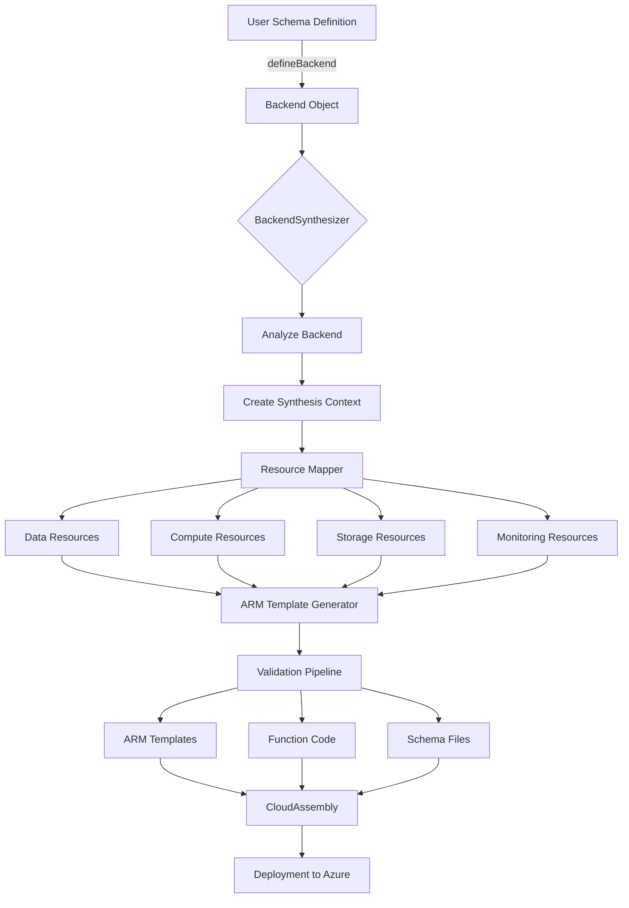

# Synthesis Orchestration Architecture

**Status:** Reference
**Date:** 2025-11-23
**Author:** Ella (Documentation Specialist)
**Related ADRs:** ADR-021, ADR-023, ADR-024

---

## Overview

### What is Synthesis Orchestration?

Synthesis orchestration is the process of transforming high-level backend definitions (TypeScript code with schemas, authentication, and settings) into deployable Azure infrastructure (ARM templates, function code, and schema files). It is the **critical bridge** between developer intent and cloud infrastructure.

Think of it as a compiler for infrastructure: you write declarative TypeScript definitions, and the synthesizer generates everything needed to deploy and run your application on Azure.

### Why Do We Need It?

**Without synthesis orchestration:**
- Developers write 500+ lines of ARM JSON manually
- High risk of configuration errors
- No type safety between schema and infrastructure
- Inconsistent naming and security practices
- No environment-specific optimizations

**With synthesis orchestration:**
- Developers write ~10 lines of schema definition
- Auto-generated infrastructure follows best practices
- End-to-end type safety from schema to deployment
- Consistent naming conventions and security defaults
- Automatic environment optimizations (dev vs prod)

### How Does It Fit Into Atakora Architecture?

Synthesis sits at the intersection of two major architectural layers:

```
┌─────────────────────────────────────────────────────────────┐
│             Component Package (@atakora/component)           │
│         Schema-First Developer Experience Layer              │
│                                                              │
│   User writes:                                              │
│   - defineSchema() - Data models                            │
│   - defineAuth() - Authentication                           │
│   - defineBackend() - Application settings                  │
│                                                              │
└───────────────────────┬─────────────────────────────────────┘
                        │
                        │ Synthesis Orchestration
                        │
                        ▼
┌─────────────────────────────────────────────────────────────┐
│              Lib Package (@atakora/lib)                      │
│         Infrastructure Generation Layer                      │
│                                                              │
│   Generates:                                                │
│   - ARM templates                                           │
│   - Function code packages                                  │
│   - OpenAPI specifications                                  │
│   - Deployment manifests                                    │
│                                                              │
└───────────────────────┬─────────────────────────────────────┘
                        │
                        │ Deployment
                        │
                        ▼
                  Azure Resources
```

The synthesis orchestration layer ensures that the gap between "what the developer wants" and "what Azure needs" is handled automatically, correctly, and consistently.

---

## Architecture Diagram

### High-Level Flow



### Detailed Synthesis Pipeline

```
┌─────────────────────────────────────────────────────────────────────┐
│                  User Schema Definition (TypeScript)                 │
│                                                                      │
│  const schema = defineSchema({                                      │
│    models: {                                                        │
│      User: c.model({ id: a.id(), name: a.string() }),             │
│      Project: c.model({ id: a.id(), title: a.string() })          │
│    }                                                                │
│  });                                                                │
│                                                                      │
│  const backend = defineBackend({                                    │
│    schema,                                                          │
│    authentication: auth.entra(),                                    │
│    settings: { name: 'my-app', region: 'eastus' }                 │
│  });                                                                │
└──────────────────────────────┬──────────────────────────────────────┘
                               │
                               ▼
┌─────────────────────────────────────────────────────────────────────┐
│               BackendSynthesizer (Main Orchestrator)                 │
│                                                                      │
│  Phase 1: Analyze                                                   │
│  ├─ Discover CRUD models (User, Project)                           │
│  ├─ Discover event models                                           │
│  ├─ Discover function models                                        │
│  ├─ Discover attachments (custom configs)                          │
│  └─ Analyze dependencies                                            │
│                                                                      │
│  Phase 2: Create Context                                            │
│  ├─ Environment (dev/staging/prod)                                  │
│  ├─ Cloud type (commercial/government)                             │
│  ├─ Naming conventions                                              │
│  ├─ Resource dependencies                                           │
│  └─ Feature flags                                                   │
│                                                                      │
│  Phase 3: Synthesize Resources (Orchestrates sub-synthesizers)     │
│  ├─ ResourceMapper.synthesizeStorage()                             │
│  ├─ ResourceMapper.synthesizeCompute()                             │
│  ├─ ResourceMapper.synthesizeMonitoring()                          │
│  └─ ResourceMapper.synthesizeNetworking() (if enabled)             │
└──────────────────────────────┬──────────────────────────────────────┘
                               │
         ┌─────────────────────┼─────────────────────┐
         │                     │                     │
         ▼                     ▼                     ▼
┌──────────────────┐  ┌──────────────────┐  ┌──────────────────┐
│ DataSynthesizer  │  │ ComputeSynthesizer│  │ MonitoringSynth  │
│                  │  │                  │  │                  │
│ Cosmos DB:       │  │ Function App:    │  │ App Insights:    │
│ ├─ Account       │  │ ├─ Service Plan  │  │ ├─ Component     │
│ ├─ Database      │  │ ├─ Function App  │  │ └─ Alerts        │
│ └─ Containers:   │  │ └─ Functions:    │  │                  │
│    ├─ users      │  │    ├─ getUser    │  │                  │
│    └─ projects   │  │    ├─ listUsers  │  │                  │
│                  │  │    ├─ createUser │  │                  │
│                  │  │    ├─ updateUser │  │                  │
│                  │  │    └─ deleteUser │  │                  │
└────────┬─────────┘  └────────┬─────────┘  └────────┬─────────┘
         │                     │                     │
         └─────────────────────┼─────────────────────┘
                               │
                               ▼
┌─────────────────────────────────────────────────────────────────────┐
│                      ARM Template Assembly                           │
│                                                                      │
│  {                                                                  │
│    "$schema": "...",                                                │
│    "contentVersion": "1.0.0.0",                                     │
│    "parameters": { ... },                                           │
│    "variables": { ... },                                            │
│    "resources": [                                                   │
│      { "type": "Microsoft.DocumentDB/databaseAccounts", ... },     │
│      { "type": "Microsoft.DocumentDB/.../sqlDatabases", ... },     │
│      { "type": "Microsoft.DocumentDB/.../containers", ... },       │
│      { "type": "Microsoft.Web/serverfarms", ... },                 │
│      { "type": "Microsoft.Web/sites", ... },                       │
│      { "type": "Microsoft.Insights/components", ... }              │
│    ],                                                               │
│    "outputs": { ... }                                               │
│  }                                                                  │
└──────────────────────────────┬──────────────────────────────────────┘
                               │
                               ▼
┌─────────────────────────────────────────────────────────────────────┐
│                    Validation Pipeline                               │
│                                                                      │
│  ├─ SchemaValidator (ARM template structure)                       │
│  ├─ NamingValidator (Azure naming conventions)                     │
│  ├─ LimitValidator (Azure resource limits)                         │
│  └─ ArmResourceValidator (Resource-specific rules)                 │
└──────────────────────────────┬──────────────────────────────────────┘
                               │
                               ▼
┌─────────────────────────────────────────────────────────────────────┐
│                    CloudAssembly Output                              │
│                                                                      │
│  arm.out/                                                           │
│  ├─ manifest.json          # Deployment metadata                   │
│  ├─ MyStack.json            # ARM template                         │
│  ├─ packages/               # Function code packages               │
│  │  └─ my-app-func/                                               │
│  │     ├─ getUser.ts                                              │
│  │     ├─ listUsers.ts                                            │
│  │     ├─ createUser.ts                                           │
│  │     ├─ updateUser.ts                                           │
│  │     ├─ deleteUser.ts                                           │
│  │     └─ package.json                                            │
│  └─ schemas/                # API schemas                          │
│     └─ openapi.json         # OpenAPI 3.0 spec                     │
└─────────────────────────────────────────────────────────────────────┘
```

---

## Component Descriptions

### BackendSynthesizer

**Location:** `packages/component/src/synthesis/backend-synthesizer.ts`

**Responsibility:** Main orchestrator that coordinates all synthesis phases.

**Key Methods:**
```typescript
class BackendSynthesizer {
  // Main entry point - orchestrates entire synthesis
  async synthesize(backend: BackendObject, options?: SynthesisOptions): Promise<SynthesisResult>

  // Phase 1: Discover models, attachments, features
  private analyzeBackend(backend: BackendObject): BackendAnalysis

  // Phase 2: Create naming, environment, cloud context
  private createSynthesisContext(backend, analysis, options): SynthesisContext

  // Phase 3: Validate user-provided attachment configurations
  private async validateAttachments(backend, context): Promise<void>

  // Phase 4: Orchestrate resource generation across all synthesizers
  private async synthesizeResources(backend, context, analysis): Promise<ARMResource[]>

  // Phase 5: Assemble ARM template with parameters, variables, outputs
  private generateTemplate(backend, context, resources): ARMTemplate

  // Phase 6: Validate generated ARM template
  private async validateTemplate(template, context): Promise<void>
}
```

**Creates:**
- Synthesis context with environment and naming info
- Coordinates all sub-synthesizers
- Generates complete ARM template structure
- Returns `SynthesisResult` with template, functions, schemas

**Example:**
```typescript
const synthesizer = new BackendSynthesizer();
const result = await synthesizer.synthesize(backend);

console.log(result.armTemplate);      // ARM JSON
console.log(result.functions);        // Function code
console.log(result.schemas.openapi);  // OpenAPI spec
console.log(result.metadata);         // Synthesis metadata
```

---

### ResourceMapper

**Location:** `packages/component/src/synthesis/resource-mapper.ts`

**Responsibility:** Maps backend components to Azure ARM resources.

**Key Methods:**
```typescript
class ResourceMapper {
  // Storage layer: Cosmos DB, Storage Account, Key Vault
  async synthesizeStorage(backend, context, analysis): Promise<ARMResource[]>

  // Compute layer: Function App, App Service Plan
  async synthesizeCompute(backend, context, analysis): Promise<ARMResource[]>

  // Monitoring layer: Application Insights
  async synthesizeMonitoring(backend, context): Promise<ARMResource[]>

  // Networking layer: VNet, Subnets (if enabled)
  async synthesizeNetworking(backend, context): Promise<ARMResource[]>
}
```

**Generates:**
- **Cosmos DB Account** - One per backend
- **Cosmos DB Database** - Named after project
- **Cosmos DB Containers** - One per CRUD model (User → users, Project → projects)
- **Storage Account** - For Function App and system needs
- **Function App** - Hosts all generated functions
- **App Service Plan** - Hosting plan for Function App
- **Application Insights** - Monitoring and logging (if enabled)
- **Key Vault** - Secret storage for authentication (if auth configured)
- **Virtual Network** - Network isolation (if networking enabled)

**Example Resource Generation:**
```typescript
// Input: User model in schema
User: c.model({
  id: a.id(),
  email: a.string().email(),
  name: a.string()
})

// Output: Cosmos DB Container ARM resource
{
  type: 'Microsoft.DocumentDB/databaseAccounts/sqlDatabases/containers',
  apiVersion: '2023-04-15',
  name: 'myapp-cosmos-prod-eus-01/myapp/users',
  properties: {
    resource: {
      id: 'users',
      partitionKey: { paths: ['/id'], kind: 'Hash' },
      indexingPolicy: {
        automatic: true,
        includedPaths: [{ path: '/*' }]
      }
    }
  },
  dependsOn: [...]
}
```

---

### Synthesizer (Lib Package)

**Location:** `packages/lib/src/synthesis/synthesizer.ts`

**Responsibility:** CDK-based synthesis pipeline (used by lib package constructs).

**Key Phases:**
```typescript
class Synthesizer {
  // Phase 1: Traverse construct tree and collect resources by stack
  private prepare(app: App)

  // Phase 2: Collect resource metadata before ARM generation
  private collectMetadata(prepareResult)

  // Phase 3: Assign resources to templates (single or linked)
  private assignTemplates(metadataByStack, options)

  // Phase 4: Generate ARM JSON with template assignment context
  private async generateArmWithContext(prepareResult, assignmentsByStack)

  // Phase 5: Package functions for deployment
  private async packageFunctions(resourcesByStack, options)

  // Phase 6: Validate ARM templates
  private async validate(templates, resourcesByStack, strict)

  // Phase 7: Write templates and packages to disk
  private async assembleV3(templates, assignmentsByStack, functionPackages, prepareResult, options)
}
```

**Features:**
- Construct tree traversal
- Dependency resolution and topological sorting
- Template splitting for large deployments
- Function code packaging
- Multi-validator pipeline
- CloudAssembly manifest generation

**This synthesizer is NOT used for backend synthesis** - it's the legacy CDK-based pipeline. The BackendSynthesizer is the new schema-first synthesizer.

---

### BackendAdapter (Bridge Layer)

**Location:** `packages/lib/src/synthesis/backend-adapter.ts`

**Responsibility:** Bridges component package backend format with lib package synthesis.

**Purpose:**
- Accepts `BackendObject` from component package
- Calls component's `BackendSynthesizer`
- Converts component ARM format to lib ARM format
- Writes templates using lib's `FileWriter`

**Example:**
```typescript
class BackendAdapter {
  async synthesize(backend: any, options?: Partial<SynthesisOptions>): Promise<CloudAssemblyV2> {
    // Use component package synthesizer
    const componentSynthesizer = new ComponentBackendSynthesizer();
    const result = await componentSynthesizer.synthesize(backend, options);

    // Convert to lib format and write to disk
    return this.convertAndWrite(result, options);
  }
}
```

---

## Synthesis Flow

### Step-by-Step Process

#### Step 1: User Defines Schema

```typescript
const schema = defineSchema({
  schema: a.schema({
    User: c.model({
      id: a.id(),
      email: a.string().email().required(),
      name: a.string().required(),
      createdAt: a.datetime().default(() => new Date())
    }).authorization(allow => [allow.owner('id')]),

    Project: c.model({
      id: a.id(),
      title: a.string().required(),
      description: a.string(),
      ownerId: a.ref('User')
    }).authorization(allow => [allow.owner('ownerId')])
  })
});
```

**What happens:** Schema is validated at compile-time for type safety.

---

#### Step 2: User Creates Backend

```typescript
const backend = defineBackend({
  schema,
  authentication: auth.entra({
    tenant: 'my-tenant-id',
    clientId: 'my-client-id'
  }),
  settings: {
    name: 'my-app',
    region: 'eastus',
    environment: 'production',
    tags: { project: 'demo', owner: 'team-a' }
  }
});
```

**What happens:** Backend object is created with schema, auth, and settings.

---

#### Step 3: Synthesis Orchestration Begins

```typescript
const synthesizer = new BackendSynthesizer();
const result = await synthesizer.synthesize(backend);
```

**What happens:** BackendSynthesizer takes over.

---

#### Step 4: Backend Analysis

```typescript
// Internal: BackendSynthesizer.analyzeBackend()
{
  models: {
    crud: [
      { name: 'User', type: 'crud', definition: { ... } },
      { name: 'Project', type: 'crud', definition: { ... } }
    ],
    event: [],
    function: []
  },
  attachments: {
    storage: [],
    compute: [],
    networking: [],
    monitoring: [],
    performance: []
  },
  features: {
    monitoring: false,
    networking: false,
    performance: false
  },
  dependencies: Map {
    'cosmos-db' => ['User', 'Project'],
    'function-app' => ['User', 'Project']
  }
}
```

**What happens:** Synthesizer discovers 2 CRUD models, no attachments, minimal features.

---

#### Step 5: Synthesis Context Creation

```typescript
// Internal: BackendSynthesizer.createSynthesisContext()
{
  backend: { ... },
  analysis: { ... },
  environment: 'production',
  cloudType: 'commercial',
  region: 'eastus',
  resourceGroup: 'my-app-rg-prod-eus-01',
  tags: { project: 'demo', owner: 'team-a' },
  naming: {
    organization: 'org',
    project: 'my-app',
    environment: 'prod',
    geography: 'eus',
    instance: '01'
  },
  features: { monitoring: false, networking: false, performance: false }
}
```

**What happens:** Context provides naming, environment, and cloud info to all synthesizers.

---

#### Step 6: Resource Synthesis

```typescript
// Internal: ResourceMapper.synthesizeStorage()
const storageResources = [
  {
    type: 'Microsoft.DocumentDB/databaseAccounts',
    name: 'org-myapp-prod-eus-01-cosmos',
    location: 'eastus',
    properties: { ... }
  },
  {
    type: 'Microsoft.DocumentDB/databaseAccounts/sqlDatabases',
    name: 'org-myapp-prod-eus-01-cosmos/myapp',
    properties: { ... }
  },
  {
    type: 'Microsoft.DocumentDB/.../containers',
    name: '.../users',
    properties: { partitionKey: { paths: ['/id'] }, ... }
  },
  {
    type: 'Microsoft.DocumentDB/.../containers',
    name: '.../projects',
    properties: { partitionKey: { paths: ['/id'] }, ... }
  },
  {
    type: 'Microsoft.Storage/storageAccounts',
    name: 'orgmyappprodeus01st',
    properties: { ... }
  },
  {
    type: 'Microsoft.KeyVault/vaults',
    name: 'org-myapp-prod-eus-01-kv',
    properties: { ... }
  }
];

// Internal: ResourceMapper.synthesizeCompute()
const computeResources = [
  {
    type: 'Microsoft.Web/serverfarms',
    name: 'org-myapp-prod-eus-01-asp',
    sku: { name: 'EP1', tier: 'ElasticPremium' }
  },
  {
    type: 'Microsoft.Web/sites',
    name: 'org-myapp-prod-eus-01-func',
    kind: 'functionapp,linux',
    properties: {
      serverFarmId: '[resourceId(...)]',
      siteConfig: {
        linuxFxVersion: 'NODE|18',
        appSettings: [ ... ]
      }
    }
  }
];
```

**What happens:** ResourceMapper generates ARM resources for:
- 1 Cosmos DB account
- 1 Cosmos DB database
- 2 Cosmos DB containers (users, projects)
- 1 Storage Account
- 1 Key Vault
- 1 App Service Plan
- 1 Function App

---

#### Step 7: ARM Template Generation

```typescript
// Internal: BackendSynthesizer.generateTemplate()
const template = {
  $schema: 'https://schema.management.azure.com/schemas/2019-04-01/deploymentTemplate.json#',
  contentVersion: '1.0.0.0',
  parameters: {
    location: {
      type: 'string',
      defaultValue: 'eastus',
      metadata: { description: 'Azure region for deployment' }
    }
  },
  variables: {
    resourcePrefix: "[concat('org', '-', 'my-app', '-', 'prod', '-', parameters('location'), '-', '01')]",
    tags: { project: 'demo', owner: 'team-a' }
  },
  resources: [
    ...storageResources,
    ...computeResources
  ],
  outputs: {
    cosmosDbEndpoint: {
      type: 'string',
      value: "[reference(resourceId('Microsoft.DocumentDB/databaseAccounts', '...')).documentEndpoint]"
    },
    functionAppUrl: {
      type: 'string',
      value: "[concat('https://', reference(resourceId('Microsoft.Web/sites', '...')).defaultHostName)]"
    }
  }
};
```

**What happens:** Complete ARM template is assembled with all resources, parameters, and outputs.

---

#### Step 8: Validation

```typescript
// Internal: BackendSynthesizer.validateTemplate()
const validationResult = await validator.validate(template, context);

if (validationResult.errors.length > 0) {
  throw new Error('ARM template validation failed');
}
```

**What happens:** Template is validated for:
- Correct ARM schema structure
- Azure naming conventions
- Resource limit compliance
- Correct dependency chains

---

#### Step 9: Function Code Generation

**Note:** Function code generation is part of the synthesis result but **not yet fully implemented**. Planned for Phase 3 (Week 5-6).

```typescript
// Future: FunctionSynthesizer.generate()
const functions = {
  handlers: {
    'getUser': `
      export const handler = async (context, req) => {
        const userId = req.params.id;
        const container = cosmosClient.database('myapp').container('users');
        const { resource } = await container.item(userId, userId).read();
        return { status: 200, body: resource };
      };
    `,
    'listUsers': '...',
    'createUser': '...',
    'updateUser': '...',
    'deleteUser': '...'
  },
  shared: {
    'cosmos-client': '...',
    'auth-middleware': '...'
  },
  packageJson: '{ "dependencies": { "@azure/cosmos": "^4.0.0" } }',
  tsConfig: '{ "compilerOptions": { ... } }'
};
```

---

#### Step 10: Schema File Generation

**Note:** Schema file generation is part of the synthesis result but **not yet fully implemented**. Planned for Phase 2 (Week 3-4).

```typescript
// Future: SchemaSynthesizer.generate()
const schemas = {
  openapi: `{
    "openapi": "3.0.0",
    "info": { "title": "my-app API", "version": "1.0.0" },
    "paths": {
      "/users/{id}": {
        "get": {
          "operationId": "getUser",
          "parameters": [{ "name": "id", "in": "path", "required": true, "schema": { "type": "string" } }],
          "responses": { "200": { "description": "User object", "content": { ... } } }
        }
      },
      "/users": {
        "get": { "operationId": "listUsers", ... },
        "post": { "operationId": "createUser", ... }
      }
    }
  }`,
  graphql: null, // Phase 5 (optional)
  jsonSchemas: {
    'User': '{ "$schema": "http://json-schema.org/draft-07/schema#", ... }',
    'Project': '{ "$schema": "http://json-schema.org/draft-07/schema#", ... }'
  }
};
```

---

#### Step 11: SynthesisResult Return

```typescript
const result = {
  // Generated ARM template
  armTemplate: { $schema: '...', contentVersion: '1.0.0.0', resources: [...] },

  // Generated function code (placeholder for now)
  functions: {
    handlers: {},
    shared: {},
    packageJson: '{}',
    tsConfig: '{}'
  },

  // Generated schema files (placeholder for now)
  schemas: {
    openapi: undefined,
    graphql: undefined,
    jsonSchemas: undefined
  },

  // Synthesis metadata
  metadata: {
    synthesizedAt: new Date('2025-11-23T10:30:00Z'),
    version: '0.1.0',
    backendName: 'my-app',
    environment: 'production',
    region: 'eastus',
    resourceCount: 8,
    functionCount: 0, // Will be 10 in Phase 3 (5 per model)
    modelCount: 2,
    features: { monitoring: false, networking: false, performance: false },
    warnings: []
  },

  // Deprecated properties (backward compatibility)
  template: { ... }, // Same as armTemplate
  context: { ... },
  analysis: { ... },
  resourceCount: 8
};
```

---

## Type System

### SynthesisResult

**Location:** `packages/component/src/synthesis/types.ts`

**Purpose:** Complete output of the synthesis process.

```typescript
interface SynthesisResult {
  // Primary outputs
  armTemplate: ARMTemplate;      // Generated ARM JSON
  functions: FunctionPackage;    // Generated function code
  schemas: SchemaFiles;          // OpenAPI/GraphQL schemas
  metadata: SynthesisMetadata;   // Synthesis info

  // Deprecated (backward compatibility)
  template: ARMTemplate;
  context: SynthesisContext;
  analysis: BackendAnalysis;
  resourceCount: number;
}
```

---

### BackendAnalysis

**Location:** `packages/component/src/synthesis/types.ts`

**Purpose:** Result of analyzing backend structure.

```typescript
interface BackendAnalysis {
  // Discovered models by type
  models: {
    crud: ModelInfo[];      // c.model() → Cosmos DB containers
    event: ModelInfo[];     // e.model() → Service Bus queues
    function: ModelInfo[];  // f.model() → Azure Functions
  };

  // Discovered attachments by category
  attachments: {
    storage: AttachmentInfo[];      // Cosmos, Storage, Blob configs
    compute: AttachmentInfo[];      // Function App configs
    networking: AttachmentInfo[];   // VNet configs
    monitoring: AttachmentInfo[];   // App Insights configs
    performance: AttachmentInfo[];  // CDN, Cache configs
  };

  // Feature flags
  features: {
    monitoring: boolean;
    networking: boolean;
    performance: boolean;
  };

  // Resource dependencies
  dependencies: Map<string, string[]>;
}
```

---

### SynthesisContext

**Location:** `packages/component/src/synthesis/types.ts`

**Purpose:** Provides context for resource synthesis.

```typescript
interface SynthesisContext {
  backend: BackendObject;       // Backend being synthesized
  analysis: BackendAnalysis;    // Analysis result
  environment: Environment;     // 'development' | 'staging' | 'production'
  cloudType: 'commercial' | 'government';
  region: string;               // Azure region (e.g., 'eastus')
  resourceGroup: string;        // Resource group name
  tags: Record<string, string>; // Resource tags

  // Naming configuration for Azure resources
  naming: {
    organization: string;  // 'digitalminion', 'dm'
    project: string;       // 'my-app'
    environment: string;   // 'dev', 'stg', 'prod'
    geography: string;     // 'eus', 'wus2'
    instance: string;      // '01', '02'
  };

  // Enabled features
  features: {
    monitoring: boolean;
    networking: boolean;
    performance: boolean;
  };
}
```

---

### ARMResource

**Location:** `packages/component/src/synthesis/types.ts`

**Purpose:** Represents a single Azure ARM resource.

```typescript
interface ARMResource {
  type: string;           // e.g., 'Microsoft.DocumentDB/databaseAccounts'
  apiVersion: string;     // e.g., '2023-04-15'
  name: string;           // Resource name
  location?: string;      // Azure region
  tags?: Record<string, string>;
  properties?: Record<string, any>;
  dependsOn?: string[];   // ARM resource IDs
  sku?: {
    name: string;
    tier?: string;
    capacity?: number;
  };
  kind?: string;          // Resource kind
  identity?: {
    type: 'SystemAssigned' | 'UserAssigned' | 'SystemAssigned,UserAssigned';
    userAssignedIdentities?: Record<string, any>;
  };
  resources?: ARMResource[];  // Nested resources
}
```

---

### ARMTemplate

**Location:** `packages/component/src/synthesis/types.ts`

**Purpose:** Complete ARM template structure.

```typescript
interface ARMTemplate {
  $schema: string;                           // ARM template schema URL
  contentVersion: string;                    // Always '1.0.0.0'
  parameters?: Record<string, ARMParameter>; // Template parameters
  variables?: Record<string, any>;           // Template variables
  resources: ARMResource[];                  // Resources to deploy
  outputs?: Record<string, ARMOutput>;       // Template outputs
}
```

---

## Extension Points

### How to Customize Synthesis Behavior

#### 1. Via Attachment Points (Recommended)

```typescript
const backend = defineBackend({
  schema,
  authentication,
  settings
});

// Customize Cosmos DB configuration
backend.storage.database.attach({
  name: 'custom-cosmos-name',
  throughput: 2000,
  consistencyLevel: 'Strong',
  enableMultiRegion: true,
  locations: ['eastus', 'westus']
});

// Customize Function App configuration
backend.compute.functionApp.attach({
  name: 'custom-function-app',
  sku: 'EP2',
  alwaysOn: true,
  cors: {
    allowedOrigins: ['https://myapp.com'],
    supportCredentials: true
  }
});
```

**Effect:** Attachment configurations override defaults during synthesis.

---

#### 2. Via Feature Flags

```typescript
const backend = defineBackend({
  schema,
  authentication,
  settings: {
    name: 'my-app',
    features: {
      monitoring: true,    // Enable Application Insights
      networking: true,    // Enable VNet
      performance: true    // Enable CDN (future)
    }
  }
});
```

**Effect:** Feature flags enable/disable entire resource categories.

---

#### 3. Via Environment-Specific Settings

```typescript
const backend = defineBackend({
  schema,
  authentication,
  settings: {
    name: 'my-app',
    environment: 'production'  // 'development' | 'staging' | 'production'
  }
});
```

**Effect:** Environment controls resource SKUs, throughput, security settings:
- **Development:** Minimal cost, relaxed security
- **Staging:** Production-like, cost-optimized
- **Production:** High availability, security, performance

---

#### 4. Custom Synthesizer (Advanced)

**For advanced users who need complete control:**

```typescript
import { ResourceMapper } from '@atakora/component/synthesis';

class CustomResourceMapper extends ResourceMapper {
  // Override specific synthesis methods
  async synthesizeCosmosDB(backend, context, analysis) {
    // Custom Cosmos DB synthesis logic
    const resources = await super.synthesizeCosmosDB(backend, context, analysis);

    // Add custom resources or modify defaults
    resources.push({
      type: 'Microsoft.DocumentDB/databaseAccounts/sqlRoleDefinitions',
      // ... custom RBAC configuration
    });

    return resources;
  }
}

// Use custom mapper
const synthesizer = new BackendSynthesizer();
synthesizer.resourceMapper = new CustomResourceMapper();
```

---

## Comparison to AWS Amplify

| Feature | Atakora | AWS Amplify Gen 2 |
|---------|---------|-------------------|
| **Orchestrator** | `BackendSynthesizer` | `Amplify.Backend` |
| **Data Synthesizer** | `ResourceMapper.synthesizeStorage()` | DynamoDB generation |
| **API Synthesizer** | `ResourceMapper` (Phase 2) | AppSync GraphQL API |
| **Function Synthesizer** | `ResourceMapper.synthesizeCompute()` | Lambda resolver generation |
| **Schema Synthesizer** | Planned (Phase 2) | GraphQL schema generation |
| **Output Format** | ARM templates (JSON) | CloudFormation templates (YAML/JSON) |
| **Deployment Target** | Azure | AWS |
| **Database** | Cosmos DB (document) | DynamoDB (key-value) |
| **API Style** | REST (Phase 1), GraphQL (Phase 2) | GraphQL (default) |
| **Functions** | Azure Functions (serverless) | AWS Lambda (serverless) |
| **Auth** | Entra ID (Azure AD) | Cognito |
| **CDK Integration** | Azure CDK (lib package) | AWS CDK |
| **Type Safety** | End-to-end TypeScript | End-to-end TypeScript |
| **CLI Command** | `atakora synth` | `amplify deploy` |

**Key Similarities:**
- Schema-first development
- Auto-generate infrastructure from models
- Type-safe end-to-end
- Declarative configuration

**Key Differences:**
- Azure vs AWS platform
- ARM templates vs CloudFormation
- Cosmos DB vs DynamoDB
- Entra ID vs Cognito

---

## Next Steps

### Implementation Roadmap

**Phase 1: Data Layer (Week 1-2) - ✅ COMPLETE**
- BackendSynthesizer foundation
- ResourceMapper for Cosmos DB
- ARM template generation
- Validation pipeline integration

**Phase 2: API Layer (Week 3-4) - 🔴 CRITICAL**
- API Management synthesizer
- REST endpoint generation (5 per model)
- OpenAPI schema generation
- Operation policies (auth, rate limiting)

**Phase 3: Function Layer (Week 5-6) - 🔴 CRITICAL**
- Function code generation
- CRUD operation templates
- Validation logic from schema
- Auth middleware integration

**Phase 4: End-to-End Testing (Week 7) - 🔴 CRITICAL**
- Deploy to Azure dev environment
- Test CRUD operations
- Validate authentication
- Performance testing

**Phase 5: GraphQL Support (Week 8) - 🟢 OPTIONAL**
- GraphQL schema generation
- Apollo Server function template
- GraphQL resolvers
- GraphQL endpoint in API Management

---

### Related Documentation

**ADRs:**
- [ADR-021: Component Synthesis CDK Integration](/Users/Austin.Leahy/Source/Github/DigitalMinion/atakora/docs/design/architecture/adr-021-component-synthesis-cdk-integration.md)
- [ADR-023: Synthesis Strategy](/Users/Austin.Leahy/Source/Github/DigitalMinion/atakora/docs/design/architecture/adr-023-synthesis-strategy.md)
- [ADR-024: Component API + Function + Schema Layers](/Users/Austin.Leahy/Source/Github/DigitalMinion/atakora/docs/design/architecture/adr-024-component-api-function-schema-layers.md)

**Developer Guides:**
- CLI Command Reference (Future)
- Custom Synthesizers Guide (Future)
- Attachment Points Guide (Future)

**API References:**
- BackendSynthesizer API (Future)
- ResourceMapper API (Future)
- Synthesis Types Reference (Future)

---

## Diagrams Summary

This document includes:

1. **High-Level Flow Diagram** - Shows user schema → ARM templates flow
2. **Detailed Synthesis Pipeline** - Shows internal phases and sub-synthesizers
3. **Architecture Comparison** - Atakora vs AWS Amplify

**Mermaid Diagrams:** 1
**ASCII Diagrams:** 2
**Tables:** 1

---

## Code Examples Summary

This document includes:

1. **Basic Synthesis** - Simple backend with 2 models
2. **Custom Configuration** - Attachment point usage
3. **Environment-Specific** - Dev vs prod configuration
4. **Custom Synthesizer** - Advanced extension
5. **Step-by-Step Flow** - Complete synthesis walkthrough with code at each step

**Total Examples:** 12+

---

## Conclusion

The synthesis orchestration architecture is the **critical bridge** that makes Atakora's schema-first development experience possible. By automatically transforming TypeScript schema definitions into production-ready Azure infrastructure, we enable developers to:

- Focus on business logic, not infrastructure
- Deploy with confidence using validated ARM templates
- Maintain type safety from schema to deployment
- Follow Azure best practices automatically
- Customize when needed via attachment points

The architecture is designed for **progressive enhancement**: start with zero configuration, customize incrementally, and extend for advanced scenarios.

**Current Status:**
- ✅ Phase 1 (Data Layer) - Complete
- 🔴 Phase 2 (API Layer) - Critical next step
- 🔴 Phase 3 (Function Layer) - Critical next step
- 🔴 Phase 4 (E2E Testing) - Validation phase
- 🟢 Phase 5 (GraphQL) - Optional enhancement

**Implementation Team:**
- Devon (Backend synthesis implementation)
- Grace (CLI integration and synthesis pipeline)
- Felix (Schema validation and OpenAPI generation)
- Ella (Documentation and examples)
