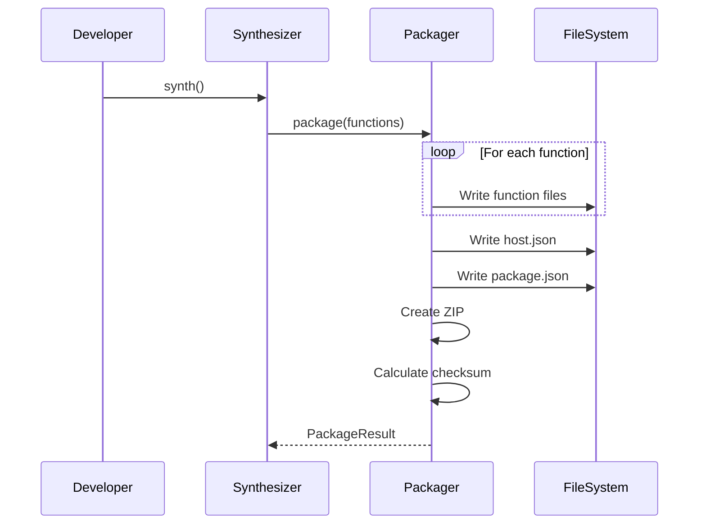
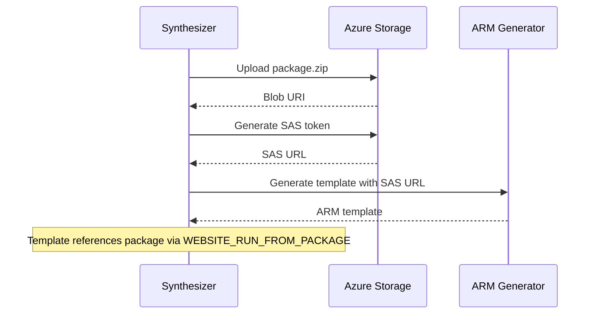
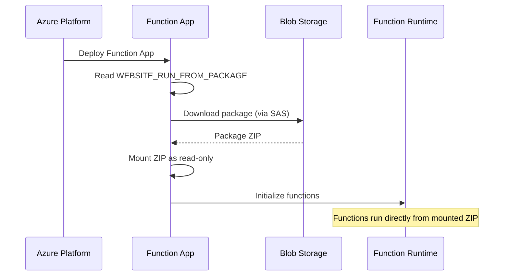

# Function Code Deployment Pattern: Run-From-Package

## Overview

This document defines the architecture for deploying Azure Functions code using the "run from package" pattern. Instead of embedding JavaScript code directly in ARM templates (causing size limit violations), we package function code into ZIP files, upload them to Azure Blob Storage, and configure Function Apps to run directly from these packages.

## Current Problem

The `InlineFunction` construct currently embeds entire JavaScript code in ARM templates:

```json
{
  "type": "Microsoft.Web/sites/functions",
  "properties": {
    "files": {
      "index.js": "/* 1MB of minified JavaScript code here */"
    }
  }
}
```

This approach:
- Bloats ARM templates beyond Azure's 4MB limit
- Mixes infrastructure definition with application code
- Makes code updates require full template redeployment
- Provides no code versioning or rollback capability

## Solution: Run-From-Package Pattern

### Architecture Overview

```
┌──────────────────────────────────────────┐
│           Synthesis Phase                 │
│                                           │
│  1. Extract code from InlineFunction     │
│  2. Bundle with dependencies             │
│  3. Create deployment package (ZIP)      │
│  4. Upload to Blob Storage               │
│  5. Generate SAS token                   │
└──────────────────────────────────────────┘
                    │
                    ▼
┌──────────────────────────────────────────┐
│           Storage Account                 │
│                                           │
│  /deployments/                           │
│    ├── {deployment-id}/                  │
│    │   ├── functions-app1.zip            │
│    │   ├── functions-app2.zip            │
│    │   └── manifest.json                 │
└──────────────────────────────────────────┘
                    │
                    ▼
┌──────────────────────────────────────────┐
│           Function App                    │
│                                           │
│  App Settings:                           │
│    WEBSITE_RUN_FROM_PACKAGE = {SAS URL}  │
│                                           │
│  Runtime: Mounts ZIP as read-only        │
└──────────────────────────────────────────┘
```

### Benefits

1. **Template Size**: Removes code from templates entirely
2. **Performance**: Azure mounts ZIP directly (no extraction needed)
3. **Atomicity**: All functions update together
4. **Versioning**: Each deployment has unique package
5. **Rollback**: Point to previous package URL
6. **Security**: SAS tokens provide time-limited access

## Package Structure

### Function Package Layout

```
function-package.zip
├── host.json                 # Function app configuration
├── package.json              # Node.js dependencies
├── node_modules/             # Dependencies (if not using remote build)
├── create-user/
│   ├── function.json        # Function trigger/binding configuration
│   └── index.js            # Function code
├── read-user/
│   ├── function.json
│   └── index.js
├── update-user/
│   ├── function.json
│   └── index.js
├── delete-user/
│   ├── function.json
│   └── index.js
└── list-users/
    ├── function.json
    └── index.js
```

### Function Configuration (function.json)

```json
{
  "bindings": [
    {
      "authLevel": "function",
      "type": "httpTrigger",
      "direction": "in",
      "name": "req",
      "methods": ["post"],
      "route": "users"
    },
    {
      "type": "http",
      "direction": "out",
      "name": "res"
    }
  ]
}
```

### Host Configuration (host.json)

```json
{
  "version": "2.0",
  "logging": {
    "applicationInsights": {
      "samplingSettings": {
        "isEnabled": true,
        "excludedTypes": "Request"
      }
    }
  },
  "extensionBundle": {
    "id": "Microsoft.Azure.Functions.ExtensionBundle",
    "version": "[3.*, 4.0.0)"
  }
}
```

## Implementation Components

### 1. Function Packager

```typescript
interface FunctionPackager {
  /**
   * Package functions for a Function App
   */
  package(functionApp: FunctionApp, functions: InlineFunction[]): Promise<PackageResult>;
}

interface PackageResult {
  packagePath: string;
  packageSize: number;
  checksum: string;
  functions: string[];
}

class AzureFunctionPackager implements FunctionPackager {
  async package(functionApp: FunctionApp, functions: InlineFunction[]): Promise<PackageResult> {
    const tempDir = await this.createTempDirectory();

    try {
      // Generate host.json
      await this.writeHostJson(tempDir, functionApp);

      // Generate package.json
      await this.writePackageJson(tempDir, functionApp);

      // Create function directories
      for (const func of functions) {
        await this.writeFunctionFiles(tempDir, func);
      }

      // Install dependencies (optional - can use remote build)
      if (functionApp.includeNodeModules) {
        await this.installDependencies(tempDir);
      }

      // Create ZIP package
      const packagePath = await this.createZipPackage(tempDir);

      // Calculate checksum
      const checksum = await this.calculateChecksum(packagePath);

      return {
        packagePath,
        packageSize: await this.getFileSize(packagePath),
        checksum,
        functions: functions.map(f => f.functionName)
      };
    } finally {
      await this.cleanup(tempDir);
    }
  }

  private async writeFunctionFiles(dir: string, func: InlineFunction): Promise<void> {
    const funcDir = path.join(dir, func.functionName);
    await fs.mkdir(funcDir, { recursive: true });

    // Write function.json
    const functionJson = {
      bindings: this.generateBindings(func)
    };
    await fs.writeFile(
      path.join(funcDir, 'function.json'),
      JSON.stringify(functionJson, null, 2)
    );

    // Write index.js
    await fs.writeFile(
      path.join(funcDir, 'index.js'),
      func.code
    );
  }
}
```

### 2. Storage Uploader

```typescript
interface StorageUploader {
  /**
   * Upload package to Azure Storage
   */
  upload(packagePath: string, deploymentId: string): Promise<UploadResult>;

  /**
   * Generate SAS token for package access
   */
  generateSasToken(blobUri: string, duration: string): Promise<string>;
}

interface UploadResult {
  blobUri: string;
  sasToken: string;
  expiresAt: Date;
}

class AzureStorageUploader implements StorageUploader {
  private readonly containerName = 'deployments';

  async upload(packagePath: string, deploymentId: string): Promise<UploadResult> {
    const blobName = `${deploymentId}/${path.basename(packagePath)}`;

    // Upload to blob storage
    const blobClient = this.containerClient.getBlockBlobClient(blobName);
    await blobClient.uploadFile(packagePath, {
      blobHTTPHeaders: {
        blobContentType: 'application/zip'
      }
    });

    // Generate SAS token (24 hour validity for runtime access)
    const sasToken = await this.generateSasToken(blobClient.url, '24h');

    return {
      blobUri: blobClient.url,
      sasToken,
      expiresAt: new Date(Date.now() + 24 * 60 * 60 * 1000)
    };
  }

  async generateSasToken(blobUri: string, duration: string): Promise<string> {
    const permissions = BlobSASPermissions.parse('r'); // Read only
    const startsOn = new Date();
    const expiresOn = new Date(startsOn.getTime() + ms(duration));

    const sasOptions: BlobGenerateSasUrlOptions = {
      permissions,
      startsOn,
      expiresOn,
      protocol: SASProtocol.Https,
    };

    return generateBlobSASQueryParameters(sasOptions, this.sharedKeyCredential).toString();
  }
}
```

### 3. ARM Template Generator

Instead of embedding code, generate Function App configuration:

```typescript
class FunctionAppTemplateGenerator {
  generate(functionApp: FunctionApp, packageUri: string): ArmResource {
    return {
      type: 'Microsoft.Web/sites',
      apiVersion: '2023-01-01',
      name: functionApp.name,
      location: functionApp.location,
      kind: 'functionapp',
      properties: {
        serverFarmId: functionApp.appServicePlanId,
        siteConfig: {
          appSettings: [
            {
              name: 'FUNCTIONS_EXTENSION_VERSION',
              value: '~4'
            },
            {
              name: 'FUNCTIONS_WORKER_RUNTIME',
              value: 'node'
            },
            {
              name: 'WEBSITE_NODE_DEFAULT_VERSION',
              value: '~18'
            },
            {
              name: 'WEBSITE_RUN_FROM_PACKAGE',
              value: packageUri  // SAS URL to ZIP package
            },
            // Other app settings...
          ],
          cors: {
            allowedOrigins: ['*']
          }
        }
      }
    };
  }
}
```

## Deployment Flow

### Phase 1: Package Creation



### Phase 2: Upload and Configuration



### Phase 3: Runtime Execution



## Security Considerations

### SAS Token Security

```typescript
interface SasTokenPolicy {
  // Permissions
  permissions: 'r';  // Read-only for packages

  // Lifetime
  duration: {
    deployment: '1h';   // Short-lived for deployment
    runtime: '24h';     // Longer for function runtime
    maximum: '7d';      // Absolute maximum
  };

  // Restrictions
  restrictions: {
    protocol: 'https';        // HTTPS only
    ipRange?: string;         // Optional IP restrictions
    correlationId?: string;   // Track token usage
  };

  // Rotation
  rotation: {
    automatic: true;
    warningPeriod: '6h';  // Warn before expiration
    gracePeriod: '1h';    // Overlap for rotation
  };
}
```

### Package Integrity

```typescript
interface PackageIntegrity {
  // Checksum validation
  checksum: {
    algorithm: 'sha256';
    validate: boolean;  // Always true in production
  };

  // Signature (future enhancement)
  signature?: {
    algorithm: 'RSA-SHA256';
    publicKey: string;
  };

  // Scanning
  scanning: {
    malware: boolean;     // Scan for malware
    vulnerabilities: boolean;  // Scan dependencies
  };
}
```

## Performance Optimizations

### Package Optimization

```typescript
class PackageOptimizer {
  optimize(packagePath: string): Promise<void> {
    // 1. Minify JavaScript
    await this.minifyJavaScript(packagePath);

    // 2. Remove unnecessary files
    await this.removeUnnecessaryFiles(packagePath, [
      '**/*.map',     // Source maps
      '**/*.ts',      // TypeScript sources
      '**/test/**',   // Test files
      '**/docs/**',   // Documentation
    ]);

    // 3. Compress with maximum compression
    await this.recompress(packagePath, {
      level: 9,  // Maximum compression
      memLevel: 9
    });
  }

  async minifyJavaScript(packagePath: string): Promise<void> {
    // Use terser or similar for minification
    const files = await glob('**/*.js', { cwd: packagePath });

    for (const file of files) {
      const code = await fs.readFile(file, 'utf-8');
      const minified = await terser.minify(code, {
        compress: true,
        mangle: true
      });
      await fs.writeFile(file, minified.code);
    }
  }
}
```

### Caching Strategy

```typescript
interface CacheStrategy {
  // Package caching
  packages: {
    key: string;  // Hash of function code + dependencies
    duration: '30d';
    storage: 'local' | 'remote';
  };

  // Deployment caching
  deployments: {
    reuseUnchanged: boolean;  // Skip upload if package unchanged
    validateChecksum: boolean;  // Verify integrity
  };
}

class PackageCache {
  async getOrCreate(key: string, creator: () => Promise<Package>): Promise<Package> {
    // Check cache
    const cached = await this.get(key);
    if (cached && await this.isValid(cached)) {
      return cached;
    }

    // Create new package
    const package = await creator();
    await this.set(key, package);
    return package;
  }
}
```

## Lifecycle Management

### Package Retention

```typescript
interface RetentionPolicy {
  // Keep packages for rollback
  production: {
    keepLast: 10;         // Keep last 10 versions
    keepDays: 90;         // Keep for 90 days
    keepTagged: true;     // Keep tagged versions forever
  };

  // Clean up old packages
  cleanup: {
    schedule: '0 2 * * *';  // Daily at 2 AM
    dryRun: false;
    notify: true;
  };
}
```

### Version Management

```typescript
interface VersionStrategy {
  // Versioning scheme
  scheme: 'semver' | 'timestamp' | 'hash';

  // Naming convention
  naming: {
    pattern: '{app}-{version}-{timestamp}.zip';
    example: 'functions-1.2.3-20240315123456.zip';
  };

  // Tagging
  tagging: {
    production: 'prod-{version}';
    staging: 'staging-{version}';
    development: 'dev-{timestamp}';
  };
}
```

## Rollback Strategy

### Quick Rollback

```typescript
class FunctionRollback {
  async rollback(functionApp: string, targetVersion: string): Promise<void> {
    // 1. Find target package
    const package = await this.findPackage(functionApp, targetVersion);

    // 2. Generate new SAS token
    const sasToken = await this.generateSasToken(package.uri);

    // 3. Update Function App setting
    await this.updateAppSetting(functionApp,
      'WEBSITE_RUN_FROM_PACKAGE',
      `${package.uri}?${sasToken}`
    );

    // 4. Restart Function App
    await this.restartFunctionApp(functionApp);

    // 5. Verify health
    await this.verifyHealth(functionApp);
  }
}
```

## Monitoring and Diagnostics

### Package Deployment Metrics

```typescript
interface DeploymentMetrics {
  // Upload metrics
  upload: {
    duration: number;      // Time to upload
    size: number;         // Package size
    speed: number;        // Upload speed
  };

  // Deployment metrics
  deployment: {
    startTime: Date;
    endTime: Date;
    status: 'success' | 'failure';
    attempts: number;
  };

  // Runtime metrics
  runtime: {
    mountTime: number;    // Time to mount package
    coldStart: number;    // Cold start duration
    errors: number;       // Package-related errors
  };
}
```

### Debugging Support

```typescript
interface DebugSupport {
  // Package inspection
  inspect: {
    listContents: boolean;     // List files in package
    validateStructure: boolean; // Check package structure
    verifyDependencies: boolean; // Check dependencies
  };

  // Deployment logs
  logging: {
    uploadProgress: boolean;
    sasGeneration: boolean;
    mountingProcess: boolean;
  };

  // Error reporting
  errors: {
    includeStackTrace: boolean;
    includePackageInfo: boolean;
    notifyOnFailure: boolean;
  };
}
```

## Migration Path

### From Inline to Package

```typescript
class InlineFunctionMigration {
  migrate(inlineFunction: InlineFunction): FunctionDefinition {
    return {
      name: inlineFunction.functionName,
      trigger: this.convertTrigger(inlineFunction.httpTrigger),
      code: inlineFunction.code,
      // No longer embedded in ARM template
      deployment: 'package'  // Instead of 'inline'
    };
  }
}
```

### Gradual Migration

1. **Phase 1**: Update synthesis to package functions
2. **Phase 2**: Maintain backward compatibility temporarily
3. **Phase 3**: Remove inline code support entirely
4. **Phase 4**: Optimize package generation

## Best Practices

### Package Organization

1. **One package per Function App** - All functions in same package
2. **Shared code in /shared** directory
3. **Environment-specific configs** via app settings
4. **Minimal dependencies** - Only include required packages

### Security Best Practices

1. **Never commit SAS tokens** to source control
2. **Rotate tokens regularly** - Automate rotation
3. **Use managed identity** when possible
4. **Scan packages** for vulnerabilities
5. **Sign packages** for integrity (future)

### Performance Best Practices

1. **Minimize package size** - Remove unnecessary files
2. **Use compression** - Maximum compression level
3. **Cache packages** - Reuse unchanged packages
4. **Parallel upload** - Upload multiple packages concurrently
5. **CDN distribution** - Use CDN for global deployments (future)