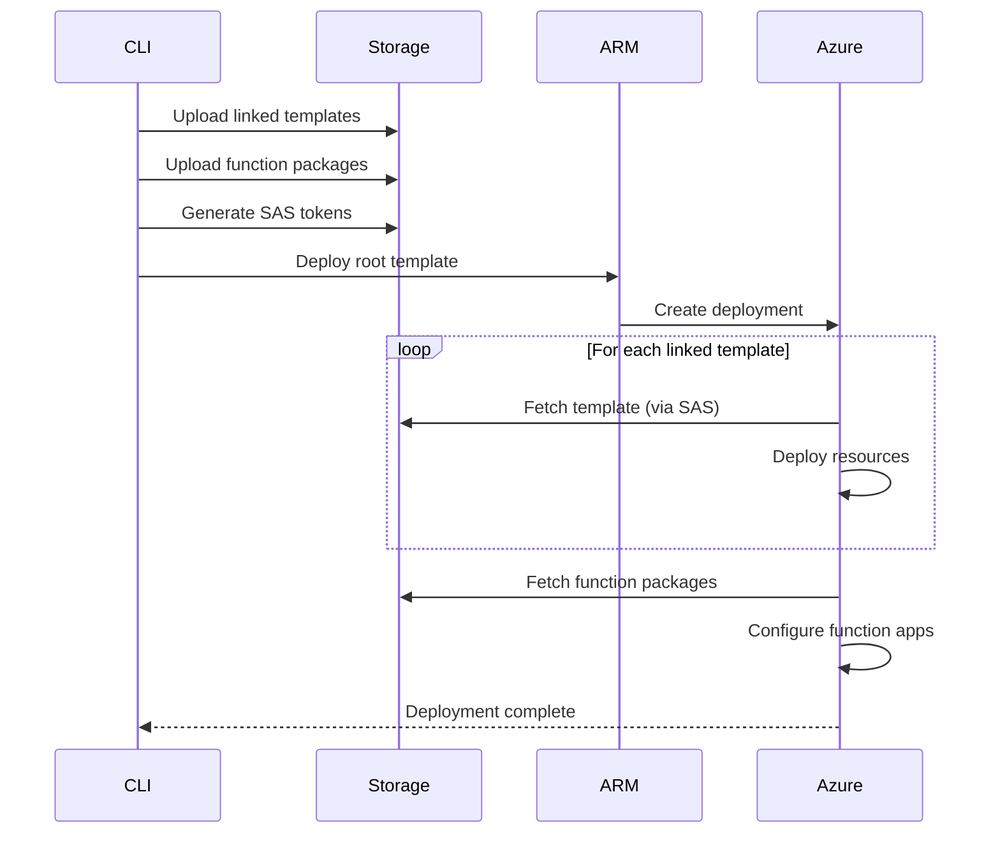

# Linked Templates Architecture Design

## Executive Summary

We are transitioning from monolithic ARM templates to **linked templates as the default and only synthesis approach**. This change is driven by Azure's 4MB template size limit, which we're exceeding with inline function code. Our Foundation stack is currently 11.2MB with 10 CRUD functions embedding JavaScript directly in the template.

This document outlines a comprehensive architecture where:
- Templates are automatically split across multiple linked templates
- Function code is deployed via "run from package" pattern
- The synthesis pipeline orchestrates artifact preparation and upload
- Developers experience zero friction - complexity is hidden

## Problem Analysis

### Current State Issues

1. **Size Limit Breach**: Foundation stack template is 11.2MB (Azure limit is 4MB)
2. **Inline Code Bloat**: Each CRUD function embeds ~1MB of JavaScript in `properties.files['index.js']`
3. **Scalability Crisis**: Adding more functions linearly increases template size
4. **No Separation of Concerns**: Infrastructure definition mixed with application code

### Root Causes

- `InlineFunction` construct embeds entire JavaScript code in ARM template
- CRUD API generates 5 functions per entity (create, read, update, delete, list)
- No artifact management system for external resources
- Synthesis pipeline produces single monolithic templates

### Impact

- **Immediate**: Deployments fail for stacks with >4 functions
- **Near-term**: Cannot scale to multi-entity CRUD APIs
- **Long-term**: Architecture fundamentally incompatible with real-world applications

## Solution Architecture

### High-Level Design

```
┌─────────────────────────────────────────────────────────────┐
│                         App Code                             │
├─────────────────────────────────────────────────────────────┤
│                    Synthesis Pipeline                        │
│  ┌─────────┐  ┌─────────┐  ┌─────────┐  ┌─────────────┐   │
│  │ Prepare │→ │Transform│→ │ Split   │→ │   Assembly   │   │
│  │         │  │         │  │ & Pack  │  │   & Upload   │   │
│  └─────────┘  └─────────┘  └─────────┘  └─────────────┘   │
├─────────────────────────────────────────────────────────────┤
│                    Artifact Storage                          │
│  ┌──────────────────┐        ┌──────────────────────┐      │
│  │ Linked Templates │        │  Function Packages   │      │
│  │   (*.json)       │        │    (*.zip)           │      │
│  └──────────────────┘        └──────────────────────┘      │
├─────────────────────────────────────────────────────────────┤
│                    Azure Deployment                          │
│  ┌──────────────────┐                                      │
│  │  Root Template   │───→ Linked Deployments               │
│  │                  │───→ Function Apps (run-from-package) │
│  └──────────────────┘                                      │
└─────────────────────────────────────────────────────────────┘
```

### Core Components

#### 1. Template Splitter
- **Location**: `packages/lib/src/synthesis/transform/template-splitter.ts`
- **Responsibility**: Intelligently split resources across multiple templates
- **Strategy**: Group by resource type and dependency relationships

#### 2. Function Packager
- **Location**: `packages/lib/src/synthesis/functions/packager.ts`
- **Responsibility**: Package function code into deployment artifacts
- **Output**: ZIP files for Azure Functions "run from package"

#### 3. Artifact Manager
- **Location**: `packages/lib/src/synthesis/assembly/artifact-manager.ts`
- **Responsibility**: Manage upload and lifecycle of templates/packages
- **Features**: SAS token generation, versioning, cleanup

#### 4. Deployment Orchestrator
- **Location**: `packages/cli/src/commands/deploy/orchestrator.ts`
- **Responsibility**: Coordinate multi-phase deployment
- **Phases**: Upload artifacts → Deploy root → Monitor progress

## Detailed Design

### Template Organization Strategy

#### Splitting Algorithm

```typescript
interface TemplateSplitStrategy {
  // Maximum size per template (leave buffer for Azure overhead)
  readonly maxTemplateSize: number; // 3.5MB to be safe

  // Group related resources together
  readonly groupingRules: {
    // Keep resource + extensions together
    keepTogether: string[][];
    // Split these resource types into separate templates
    isolate: string[];
    // Maximum resources per template
    maxResourcesPerTemplate: number;
  };

  // Dependency-aware splitting
  readonly preserveDependencies: boolean;
}
```

#### Resource Grouping Hierarchy

1. **Level 1: Infrastructure Foundation**
   - Storage Accounts
   - Cosmos DB Accounts
   - Virtual Networks

2. **Level 2: Compute Resources**
   - Function Apps (without code)
   - App Service Plans
   - Container Instances

3. **Level 3: Application Resources**
   - Function definitions (metadata only)
   - API Management APIs
   - Application Insights

4. **Level 4: Configuration**
   - Role Assignments
   - Diagnostic Settings
   - Alerts and Metrics

### Function Code Deployment Pattern

#### Run-From-Package Architecture

```typescript
interface FunctionPackageStrategy {
  // Package format
  readonly format: 'zip';

  // Storage location
  readonly storageAccount: {
    // Dedicated storage for deployment artifacts
    readonly name: string;
    readonly container: 'deployments';
    readonly lifecycle: {
      // Auto-cleanup old packages
      retentionDays: 30;
    };
  };

  // Deployment method
  readonly deployment: {
    // Use WEBSITE_RUN_FROM_PACKAGE app setting
    method: 'runFromPackage';
    // Generate SAS token with limited lifetime
    sasTokenDuration: '24h';
  };
}
```

#### Function App Configuration

```json
{
  "type": "Microsoft.Web/sites",
  "properties": {
    "siteConfig": {
      "appSettings": [
        {
          "name": "WEBSITE_RUN_FROM_PACKAGE",
          "value": "[concat(variables('storageUri'), '/', parameters('packageName'), '?', parameters('sasToken'))]"
        }
      ]
    }
  }
}
```

### Storage Strategy

#### Artifact Storage Account

- **Purpose**: Store linked templates and function packages
- **Naming**: `stdeploy{uniqueString}` (8-character unique suffix)
- **Structure**:
  ```
  storage-account/
  ├── templates/
  │   ├── {deployment-id}/
  │   │   ├── root.json
  │   │   ├── infrastructure.json
  │   │   ├── compute.json
  │   │   └── configuration.json
  └── packages/
      └── {deployment-id}/
          ├── function-app-1.zip
          └── function-app-2.zip
  ```

#### SAS Token Management

```typescript
interface SasTokenStrategy {
  // Token permissions
  readonly permissions: {
    templates: 'read';
    packages: 'read';
  };

  // Token lifetime
  readonly duration: {
    deployment: '1h';  // Short-lived for deployment
    runtime: '24h';    // Longer for function runtime
  };

  // Security
  readonly restrictions: {
    ip: string[];      // Optional IP restrictions
    protocol: 'https'; // HTTPS only
  };
}
```

### Synthesis Pipeline Changes

#### Phase 1: Prepare (No Changes)
- Traverse construct tree
- Collect resources by stack
- Validate resource organization

#### Phase 2: Transform (Enhanced)
- Convert resources to ARM JSON
- **NEW**: Extract function code from InlineFunction
- **NEW**: Generate function manifests (without code)
- Resolve dependencies

#### Phase 3: Split & Package (New Phase)
- **Split templates** based on size and grouping rules
- **Package functions** into deployment ZIPs
- **Generate deployment manifest** with artifact references
- **Calculate checksums** for integrity validation

#### Phase 4: Assembly & Upload (Enhanced)
- **Upload templates** to storage account
- **Upload packages** to storage account
- **Generate SAS tokens** for all artifacts
- **Create root template** with linked deployments
- Write local manifest with artifact URIs

### Deployment Flow



### Manifest Structure

#### Current Manifest
```json
{
  "version": "1.0.0",
  "stacks": {
    "Foundation": {
      "templatePath": "Foundation.json"
    }
  }
}
```

#### New Manifest
```json
{
  "version": "2.0.0",
  "deploymentId": "deploy-20240315-123456",
  "artifacts": {
    "storage": {
      "account": "stdeploy7h8j9k2m",
      "container": "deployments"
    },
    "templates": {
      "root": {
        "path": "templates/deploy-20240315-123456/root.json",
        "uri": "https://stdeploy7h8j9k2m.blob.core.windows.net/...",
        "checksum": "sha256:abc123..."
      },
      "linked": [
        {
          "name": "infrastructure",
          "path": "templates/deploy-20240315-123456/infrastructure.json",
          "uri": "https://stdeploy7h8j9k2m.blob.core.windows.net/...",
          "checksum": "sha256:def456..."
        }
      ]
    },
    "packages": [
      {
        "name": "crud-functions",
        "path": "packages/deploy-20240315-123456/crud-functions.zip",
        "uri": "https://stdeploy7h8j9k2m.blob.core.windows.net/...",
        "checksum": "sha256:ghi789..."
      }
    ]
  },
  "stacks": {
    "Foundation": {
      "rootTemplate": "artifacts.templates.root",
      "linkedTemplates": ["infrastructure", "compute", "configuration"],
      "packages": ["crud-functions"]
    }
  }
}
```

## Implementation Roadmap

### Phase 1: Core Infrastructure (Week 1-2)
1. Implement `TemplateSplitter` class
2. Create `FunctionPackager` class
3. Build `ArtifactManager` for storage operations
4. Update synthesis pipeline to use new components

### Phase 2: Storage & Upload (Week 2-3)
1. Create storage account provisioning logic
2. Implement SAS token generation
3. Build artifact upload system
4. Add checksum validation

### Phase 3: Template Generation (Week 3-4)
1. Modify `InlineFunction` to generate metadata only
2. Update `ResourceTransformer` for linked templates
3. Implement root template generation
4. Add template size validation

### Phase 4: Deployment Integration (Week 4-5)
1. Update CLI deploy command
2. Implement deployment orchestration
3. Add progress monitoring
4. Build rollback capabilities

### Phase 5: Testing & Migration (Week 5-6)
1. Unit tests for all new components
2. Integration tests for full pipeline
3. Migration guide for existing code
4. Performance benchmarks

## Migration Strategy

### Breaking Changes
- `InlineFunction` no longer embeds code directly
- Synthesis output structure changes
- Deployment requires storage account

### Migration Path
1. **Immediate**: All new synthesis uses linked templates
2. **No Legacy Mode**: Old monolithic approach is removed
3. **Automatic Conversion**: Existing constructs work without changes
4. **Transparent to Developers**: Complexity hidden in synthesis layer

### Developer Experience
```typescript
// BEFORE: No changes needed in application code
const func = new InlineFunction(functionApp, 'CreateUser', {
  functionName: 'create-user',
  code: generatedCode,
  httpTrigger: { methods: ['POST'] }
});

// AFTER: Exact same code continues to work
const func = new InlineFunction(functionApp, 'CreateUser', {
  functionName: 'create-user',
  code: generatedCode,
  httpTrigger: { methods: ['POST'] }
});
// But synthesis now generates linked templates + packages automatically
```

## Success Metrics

### Technical Metrics
- Template size: All templates <3.5MB
- Deployment time: <20% increase despite multi-phase
- Storage overhead: <100MB per deployment
- SAS token security: 100% HTTPS, time-limited

### Developer Metrics
- Zero code changes required
- Deployment success rate >99%
- Clear error messages for failures
- Rollback time <5 minutes

## Security Considerations

### Storage Account Security
- Private endpoints only (no public access)
- Managed identity for CLI access
- SAS tokens for deployment-time access
- Automatic token expiration

### Package Integrity
- SHA256 checksums for all artifacts
- Signature validation before deployment
- Immutable packages (no overwrites)
- Audit logging for all operations

## Performance Optimizations

### Parallel Operations
- Upload templates in parallel
- Upload packages in parallel
- Deploy independent templates concurrently
- Stream large files (don't load in memory)

### Caching Strategy
- Cache generated packages between deployments
- Reuse unchanged templates
- Skip upload if checksum matches
- Local manifest cache for quick lookups

## Error Handling

### Failure Scenarios
1. **Storage Upload Failure**: Retry with exponential backoff
2. **Template Too Large**: Split into smaller chunks
3. **SAS Token Expired**: Regenerate and retry
4. **Deployment Failed**: Rollback to previous version

### Error Messages
```typescript
// Clear, actionable error messages
throw new Error(
  `Template size (${size}MB) exceeds limit (3.5MB). ` +
  `Template will be automatically split. ` +
  `Largest resource: ${largestResource.name} (${largestResource.size}MB)`
);
```

## Governance & Compliance

### Government Cloud Support
- Use appropriate storage endpoints (.blob.core.usgovcloudapi.net)
- Comply with FedRAMP controls
- Support air-gapped environments
- Regional data residency

### Audit & Compliance
- Log all artifact operations
- Track deployment history
- Maintain artifact retention policy
- Support compliance scanning

## Alternative Approaches Considered

### 1. Nested Templates (Rejected)
- Still subject to 4MB total limit
- Doesn't solve our core problem
- More complex than linked templates

### 2. Azure Bicep (Rejected)
- Requires learning new DSL
- Less flexibility than TypeScript
- Still produces ARM templates ultimately

### 3. Terraform (Rejected)
- Complete rewrite required
- Different ecosystem
- Loses TypeScript benefits

### 4. Custom Resource Providers (Rejected)
- Complex to implement
- Requires hosting infrastructure
- Operational overhead

## Conclusion

Linked templates as the default synthesis approach solves our immediate size limit problem while providing a scalable foundation for growth. The architecture:

- **Solves the 4MB limit** through intelligent splitting
- **Maintains developer experience** with zero code changes
- **Enables scalability** for unlimited functions/resources
- **Improves deployment** with parallel operations
- **Enhances security** through SAS tokens and private storage

This is not an optional feature but the **only way** we synthesize templates going forward, ensuring every deployment can scale without hitting Azure limits.